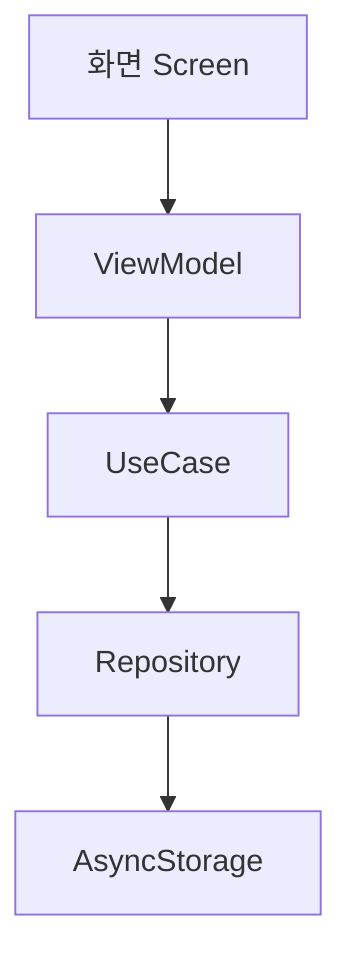

# 시스템 아키텍처

## 레이어 구조

```
Presentation → Application → Domain → Data
```

| 레이어 | 책임 | 주요 파일 위치 |
|---|---|---|
| Presentation | 화면 렌더링, 사용자 입력 처리 | `src/presentation/` |
| Application | 흐름 제어, 상태 관리 (ViewModel) | `src/application/` |
| Domain | 핵심 비즈니스 규칙, 엔티티 정의 | `src/domain/` |
| Data | AsyncStorage 읽기/쓰기, 외부 데이터 | `src/data/` |

## 핵심 기능별 레이어 흐름

| 기능 | Presentation | Application | Domain | Data |
|---|---|---|---|---|
| 일기 작성 | `WriteScreen` | `DiaryViewModel` | `Diary` 엔티티 | `DiaryRepository` |
| 일기 목록 조회 | `HomeScreen` | `HomeViewModel` | `DiaryList` 규칙 | `AsyncStorage` |
| 주제별 프롬프트 | `PromptWidget` | `PromptViewModel` | `Prompt` 엔티티 | `topics.json` |

## 주제 & 제시어 데이터 흐름

주제는 앱 내 정적 파일(`src/data/topics.json`)에서 관리한다.
새 주제를 추가하려면 Gemini 프롬프트 템플릿으로 JSON을 생성해 파일에 추가한다.

```
[사용자] 주제어 입력
    → [Gemini] 아침 맥락 제시어 5개 생성
    → [개발자] 결과 JSON을 topics.json에 추가
    → [앱] PromptRepository가 topics.json 읽어 화면에 표시
```

`topics.json` 구조:
```json
[
  {
    "topic": "하루 의도 설정",
    "prompts": [
      "오늘 하루 어떻게 보내고 싶어?",
      "오늘 꼭 하고 싶은 한 가지는?"
    ]
  }
]
```

## 디렉토리 구조

```
src/
├── presentation/
│   ├── screens/        # 화면 컴포넌트
│   ├── components/     # 재사용 UI 컴포넌트
│   └── navigation/     # React Navigation 설정
├── application/
│   └── viewmodels/     # 상태 + 비즈니스 흐름
├── domain/
│   ├── entities/       # 데이터 모델 타입
│   └── usecases/       # 핵심 규칙 함수
└── data/
    └── repositories/   # AsyncStorage 접근
```

## Mermaid 다이어그램



## 새 기능 추가 시 파일 위치 규칙

| 추가할 것 | 위치 |
|---|---|
| 새 화면 | `src/presentation/screens/` |
| 상태 관리 | `src/application/viewmodels/` |
| 비즈니스 규칙 | `src/domain/usecases/` |
| 데이터 타입 | `src/domain/entities/` |
| 저장소 접근 | `src/data/repositories/` |

## 미결 설계 이슈

- [ ] 알림 기능: Expo Notifications 권한 흐름 확인 필요
- [ ] 기분 통계: 집계 로직을 Domain vs Application 중 어디에 둘지 미결
