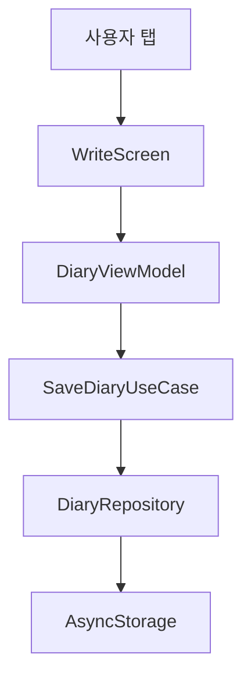

# 아키텍처 개요

## 앱 목적

매일 아침 2~3분, 주제별 프롬프트를 보고 오늘의 나를 기록하는 모바일 일기 앱.

## 전체 레이어 설명

이 앱은 **Layered Architecture + MVVM** 패턴을 따릅니다.

```
Presentation → Application → Domain → Data
```

- **Presentation**: 사용자가 보는 화면과 버튼. React Native 컴포넌트.
- **Application**: 화면과 데이터 사이의 다리. 상태를 들고 흐름을 제어.
- **Domain**: "일기란 무엇인가" 같은 핵심 규칙. 플랫폼에 의존하지 않음.
- **Data**: AsyncStorage에 실제로 읽고 쓰는 코드.

## 사용자 액션 흐름

사용자가 일기를 저장할 때:

```
[저장 버튼 탭]
    → WriteScreen (Presentation)
    → DiaryViewModel.save() (Application)
    → SaveDiaryUseCase.execute() (Domain)
    → DiaryRepository.save() (Data)
    → AsyncStorage.setItem() (Data)
```

## Mermaid 다이어그램



## 주제 & 제시어 관리 방식

주제와 제시어는 `src/data/topics.json`에 정적 파일로 관리한다.
앱이 로드될 때 파일을 읽어 주제 목록을 표시하며, 인터넷 연결 없이 동작한다.

**새 주제 추가 방법:**
1. 아래 Gemini 프롬프트에 주제어를 넣어 실행
2. 생성된 JSON을 `src/data/topics.json` 배열에 추가
3. 앱 재실행 시 새 주제가 목록에 표시됨

```
너는 아침 일기 앱의 제시어 생성기야.
사용자가 입력한 주제: [주제 입력]
조건: 아침에 하루 시작 전 스스로에게 물어볼 질문 / 오늘 아직 일어나지 않은 일 금지 / 짧고 친근한 말투 / 5개
출력: { "topic": "...", "prompts": ["...", "...", "...", "...", "..."] }
```

## 새 기능 추가 위치 규칙

| 추가할 것 | 위치 | 예시 |
|---|---|---|
| 새 화면 | `src/presentation/screens/` | `StatsScreen.tsx` |
| 상태/흐름 | `src/application/viewmodels/` | `StatsViewModel.ts` |
| 비즈니스 규칙 | `src/domain/usecases/` | `GetMoodStatsUseCase.ts` |
| 데이터 타입 | `src/domain/entities/` | `MoodEntry.ts` |
| 저장소 | `src/data/repositories/` | `MoodRepository.ts` |

## 미결 설계 이슈

- 알림 스케줄링: 앱이 백그라운드일 때 Expo Notifications 동작 검증 필요
- 기분 통계 집계: Domain UseCase로 처리할지 Application ViewModel에서 처리할지 결정 필요
